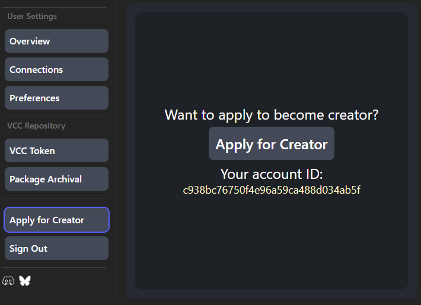

# 👋 Welcome!

Thanks for choosing Uni-VCC!

This section is meant to help you learn important things about how the platform functions and what requirements it has to enable you publishing custom assets!

## Prerequisites

Before you start uploading your creations to Uni-VCC you must first apply for creator!

After logging in (learn more in [Accounts](../user/basics/account.md) page), please go to your Dashboard.

There you'll see the `Apply for Creator` button:

Click on the yellow string of text (Your Account ID), and paste it in the form that will open upon pressing the button.

Fill out the rest of the form and submit.
After that just wait till you get approved!

## Platform Support

Here's a list of supported platforms for Uni-VCC:

- [Gumroad](https://gumroad.com/)
- [Jinxxy](https://jinxxy.com/)
- [itch.io](https://itch.io/)
