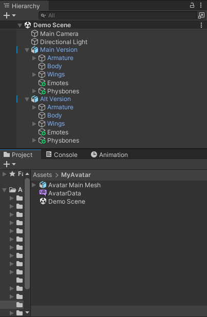
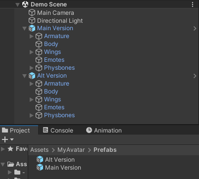
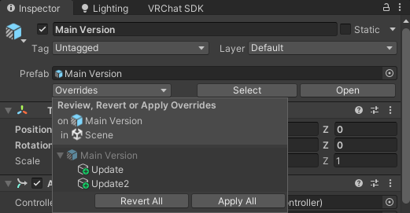
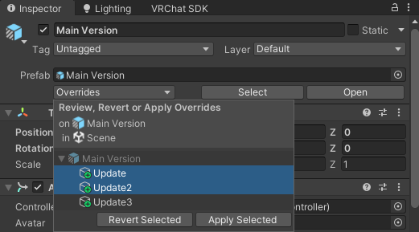

# Prefabification

This is one of the most important tips, and is a requirement to publish assets on Uni-V.CC.

Keep your assets as prefabs and/or prefab variants!

## Converting
For example: You have a model (FBX), and also add a bunch of things using VRCFury ontop inside the scene.

Think of something like this:

You can easily turn it into prefabs by grabbing the object inside the hierarchy (would be `Main Version` and `Alt Version` objects on the screenshot above) and dragging them into the folder (where `Avatar Main Mesh`, `Avatar Data` and `Demo Scene` are on the screenshot)

This would turn the asset into a prefab file which contains all the additions ontop of the FBX.

Now you might build more versions ontop of that prefab (for example, tweaking blendshapes), and drag that again into the files. A menu will pop up asking if you want to make a new prefab, or a variant. In these cases you'd most likely want to create a variant.

This way you can have three prefab layers:
1. The FBX file itself
2. Basic features (Gestures, Custom animations, GoGoLoco etc)
3. Custom versions (Male/Female, Body shapes etc)

And best part is when you edit the second layer, the changes will propagate downstream to all end-user prefabs.

After moving things out, your scene should look something like this:

The icons would change to reflect it's a prefab (or variant of).

## Updating prefab

To update your prefab, double click on it as it was a scene, and add features inside. If you've done things correctly, once you open a scene with said prefab, you'll see those changes appear on the scene.

Alternatively, if you've done any changes inside a scene with the prefab variant, you can click on the root GameObject of the prefab (in Hierarchy), you can apply the updates (overrides).

Navigate to inspector and click `Apply All`:

Alternatively, if you want to apply only some of the changes, hold `Ctrl` and left-click all changes you want to apply. Then click on `Apply Selected`:

And if you feel like some changes didn't work out either, you can just revert them as well.

## So why bother?

Prefabs are great for end users to tinker around with. They offer a set of 'pre-baked' features as a reference file, which can be put into any scene, and will retain the link between updates.

Whenever the end user updates to newer version of the prefab, the overrides (like third party addons) will remain, while the prefab itself receives the desired feature updates.

These same prefabs are also used by Uni-V.CC to import on end user's scene. Additionally, Uni-V.CC copies the material and relevant textures into `_UniVCC-Avatars/AvatarName/Materials` and `_UniVCC-Avatars/AvatarName/Textures` in an easy and predictable way.