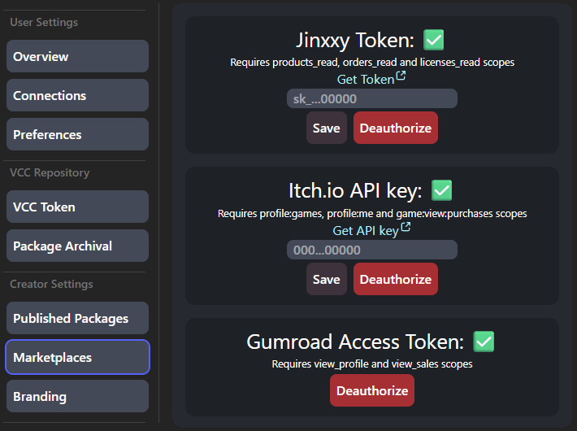

# Marketplaces

Uni-V.CC does not offer a way to puchase packages directly, and instead it relies on third parties to handle purchasing.

You will need to link supported marketplaces (see [Platform Support](../intro.md#platform-support)).

Go to your [Creator Dashboard](https://uni-v.cc/dash/creator), and click on `Manage Marketplaces...`

You will see a few sections. Connect the ones that you're going to be using.

After this, you should be able to perform [Product Linking](./packages.md#product-linking) and let users verify their license keys against your products.