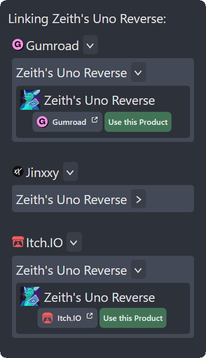

# Packages

## Packages vs Products

By Uni-V.CC's definition, these are two disctinct entities;

Package is what people see when searching for assets. It has name, summary and a list of linked products.

Product is a link between package on Uni-V.CC and third-party service.

## Creation

In your [Creator Dashboard](https://uni-v.cc/creator-dashboard), click `New Package...`

You'll see a few required fields you must fill out before creating the package:

- Package Name: Self-explanatory. This name is displayed in the package browser.
- Package ID: This is a little trickier to explain. 
  - If you don't own a domain, just stick to `myname.myavatar` syntax. For example: `zeith.uno-card`.
  - If you own a domain, however, you can do something more interesting. For example: domain of `zeith.dev` can be used, assume we have `uno-card` subdomain (so `uno-card.zeith.dev`), the package ID in this case would be `dev.zeith.uno-card`.
- Package Type: Dropdown with a few options:
  - Avatar: Your package is an avatar. It provides a `VRCAvatarDescriptor` component.
  - Avatar Edit: Your package is a modified version of an avatar. This is not yet implemented.
  - Avatar Addon: Your package is an addon for a specific avatar. It could be something like clothes that can only fit one specific avatar.
  - Universal Addon: Your package is a prefab that can be installed onto any avatar.
After you've filled everything out, you can create the package.

## Editing

Once you've created a package, you can click into it, and edit it's basic details.

You'll also see the `List this Package` section, which will be unlisted by default.

Once you have everything linked together, you can list the package.

## Product Linking

Before publishing a package, you will have to connect your package to at least one product for it to be obtainable.

Click on `Link To Product` in your package editor, wait for it to load (it usually takes a few seconds to load).

Choose a platform, find a correct product, expand it and select the version of the product that you want to link to by clicking on `Use this Product` button.

If everything goes okay, you will see the product links appear on the right sidebar of the package editor.

You can also choose a thumbnail from a similar popup by clicking on `Select Thumbnail` button. It will not show products without a thumbnail image.

## Versions

In the package editor, you'll see `Manage Versions` tab. Upon opening it, you'll see an `Upload...` button and list of versions you have uploaded to Uni-V.CC with a search bar.

Uploading a new version consists of three steps:
- Selecting and uploading .unitypackage file
- Filling out version information:
  :::info
  The version information you put is saved in your browser, making subsequent updates quicker to fill out.
  :::
  - Version (ex. 1.0.0, 1.4.0 etc)
  - Unity (2019.4, 2022.3 etc)
  - Dependencies: list of dependencies with minimal supported versions.
    *Here are a few common dependencies you might want to use:*
    - `com.vrcfury.vrcfury` - VRCFury
    - `com.poiyomi.toon` - Poiyomi Toon