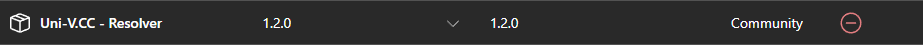

# Unity Setup

## Prerequisites

To get your asset ready, you must first install `Uni-VCC - Resolver` in the VCC's package management.

Make sure you've added the [VPM Repository](../../user/basics/repository.md) to your VRChat Creator Companion first!

## Unity

Afterwards, in Unity's project files tab, go to the root path of your avatar, ex. `Assets/Avatars/AvatarName/` where all root folders related to your avatars are located.

In the root, create a new asset package (`Create` > `VRChat` > `Uni-VCC` > `Asset Package`)

You can name the file however you'd like, it just needs to exist for the resolver to locate it.

After creating and renaming the file, click on it and edit the fields inside the `Inspector` tab.

## Setting up Asset Package

### Name
First off, give your asset a name. Do not use any characters that can not be used for filenames.

Good names:
- `AvatarName`
- `Avatar Name`

Bad names:
- `AuthorName/AvatarName`
- `AvatarName?`
- `Avatar*Name`

Basically, avoid using these characters: `\`, `/`, `:`, `*`, `?`, `"`, `<`, `>`, `|`

Ideally this should match the name of your avatar/prefab.

### Is Avatar

This is a very simple one.
Tick the box if you are working with avatar.

:::tip
If your avatar comes with prebuilt prefabs (clothing, face tracking prefab etc), you will have to create a second `Asset Package` that will have the `Is Avatar` unticked.
:::

### Prefab Count

This is the amount of files you want to be reachable by the resolver for the end users.

If you have one base prefab, set the value to 1. You will be limited to max of 32 prefabs per asset package.

After setting the value, you'll notice a new section appear.

### Prefabs:

This is a list of prefabs that Uni-VCC will resolve when end users will be importing your package.

Click on `Select` button on the right, and choose a `.prefab` file.

## The Results

Finally, the result of this setup should look something like so:

You can create multiple asset packages inside your avatar, but if you're publishing a prefab which is not an avatar, stick to having just one asset package file.