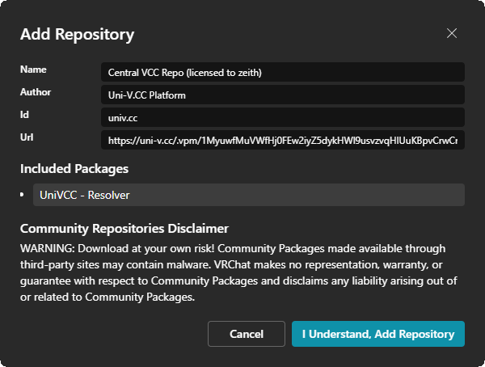

# VPM Repository

Inside your dashboard, you will see `Your token is ✅ Active`.
This means that everything is ready to be used.

Below the label you will find `Add to VCC` and `Copy Repo URL` buttons.

Try using `Add to VCC` first to add the repository into VRChat Creator Companion for you.
It should bring this menu up:

:::warning Note
VRChat Creator Companion is a bit finicky and may crash at times. This is a "normal" behavior.

Try closing companion and clicking the button afterwards.
:::