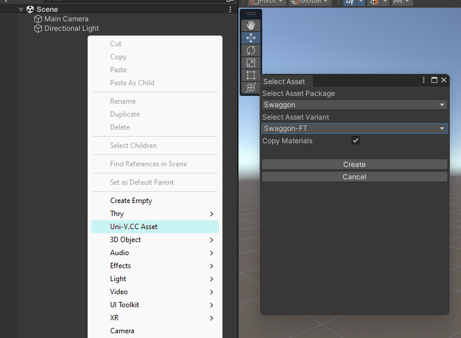

# Unity Integration

When installing avatars and prefabs from Uni-V.CC, a new option will appear when right-clicking on the scene hierarchy:

Upon clicking the creation dialog, you should see the import dialog like this:

Select the asset package and its variant, and click "Create".

It will take a few seconds to copy over all materials and textures, be patient.

After the creation is complete, you'll see the avatar appear on the scene, and additionally you'll find `Assets/!Uni-V.CC Packages/` folder.

Inside, you will find the relevant asset folder, which contains `Materials` and `Textures`. Those are safe to edit as you wish.

:::danger CAUTION
Do not unpack prefabs, it is going to break future updates.
Consider removing components and creating copies with modified parameters (for VRCFury specifically)
:::